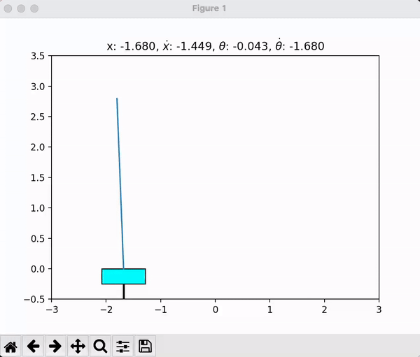

# Pole Balancer

## About Pole Balancer
Pole Balancer is a Python program that uses reinforcement learning (RL) to automatically design a policy for the classic controls problem of a cart balancing a pole. Through Markov decision processes framework, we can perform reinforcement learning without having any explicit knowledge of the physics of the underlying system, in our case, the pole and on the cart.

## Model
A thin pole is hinged to a cart. The cart moves laterally on a smooth table surface. The program fails if either the angle of the pole deviates by more than a particular amount from the vertical position (i.e., if the pole falls over), or if the cart’s position goes out of bounds (i.e., if it falls off the end of the table). 

 

## Program Objective
Balance the pole with these constraints, by appropriately having the cart accelerate left and right.
